# Diagram Sistem — Sura Warga

Dokumen ini berisi **class diagram** (model data & modul) dan **sequence diagram** level proses bisnis untuk aplikasi Sura Warga (sistem presensi & e-voting warga). Sequence diagram sengaja disederhanakan (level Aplikasi–Server–Basis Data) agar mudah dibaca untuk keperluan dokumentasi skripsi/tugas akhir, tanpa detail implementasi kode. Semua diagram ditulis dalam sintaks [Mermaid](https://mermaid.js.org/) dan dapat dipratinjau lewat `docs/index.html`.

## Daftar Isi

1. [Catatan Umum](#catatan-umum)
2. [Class Diagram — Model Data](#class-diagram--model-data)
3. [Class Diagram — Modul / Service](#class-diagram--modul--service)
4. Sequence Diagram per Proses
   - [4.1 Login (Admin & Warga)](#41-login-admin--warga)
   - [4.2 Logout](#42-logout)
   - [4.3 Presensi (Attendance Toggle)](#43-presensi-attendance-toggle)
   - [4.4 Akses Bilik Suara (Set Active Voter)](#44-akses-bilik-suara-set-active-voter)
   - [4.5 Proses E-Voting End-to-End (Cast Vote)](#45-proses-e-voting-end-to-end-cast-vote)
   - [4.6 Mulai Sesi Voting (Start)](#46-mulai-sesi-voting-start)
   - [4.7 Tutup Sesi Voting (Close)](#47-tutup-sesi-voting-close)
   - [4.8 Reset Sesi Voting](#48-reset-sesi-voting)
   - [4.9 CRUD Warga (Resident)](#49-crud-warga-resident)
   - [4.10 Import Warga dari Excel](#410-import-warga-dari-excel)
   - [4.11 Kelola Akses Warga (Lihat & Kirim Email)](#411-kelola-akses-warga-lihat--kirim-email)
   - [4.12 CRUD Kandidat](#412-crud-kandidat)
   - [4.13 CRUD User Admin (Super Admin)](#413-crud-user-admin-super-admin)
   - [4.14 Bootstrap / Initial Load](#414-bootstrap--initial-load)
   - [4.15 Analisis AI Hasil Pemilihan](#415-analisis-ai-hasil-pemilihan)
   - [4.16 Live Notifications (SSE)](#416-live-notifications-sse)
5. Flowchart Analisis Sistem (Bab 3)
   - [5.1 Flowchart Sistem Berjalan (Manual)](#51-flowchart-sistem-berjalan-manual)
   - [5.2 Flowchart Sistem Usulan (E-Voting)](#52-flowchart-sistem-usulan-e-voting)

---

## Catatan Umum

- Setiap sequence diagram menggunakan 3–4 pihak umum: **Warga/Admin/Super Admin** (pengguna), **UI Aplikasi** (antarmuka yang dilihat pengguna), **Server** (logika bisnis & aturan sistem), dan **Basis Data** (penyimpanan data).
- Warga hanya dapat mengakses aplikasi selama status pemilihan sedang **Aktif**; di luar masa itu akses warga otomatis ditolak oleh Server.
- Semua proses yang mengubah data penting (presensi, akses bilik suara, pemungutan suara, dan status sesi pemilihan) diproses satu per satu oleh Server, sehingga tidak terjadi tabrakan data ketika beberapa warga mengakses sistem secara bersamaan.
- Suara warga dienkripsi terlebih dahulu di perangkat warga sebelum dikirim ke Server, dan baru didekripsi serta divalidasi di sisi Server — lihat detail pada [4.5 Proses E-Voting](#45-proses-e-voting-end-to-end-cast-vote).
- Riwayat sesi pemilihan yang sudah selesai dapat dilihat kembali oleh Admin sebagai data historis; tidak digambarkan sebagai diagram tersendiri karena sifatnya hanya menampilkan data (read-only), mengikuti pola pada [4.14 Bootstrap](#414-bootstrap--initial-load).

---

## Class Diagram — Model Data

Entity inti dari model data aplikasi beserta relasinya.

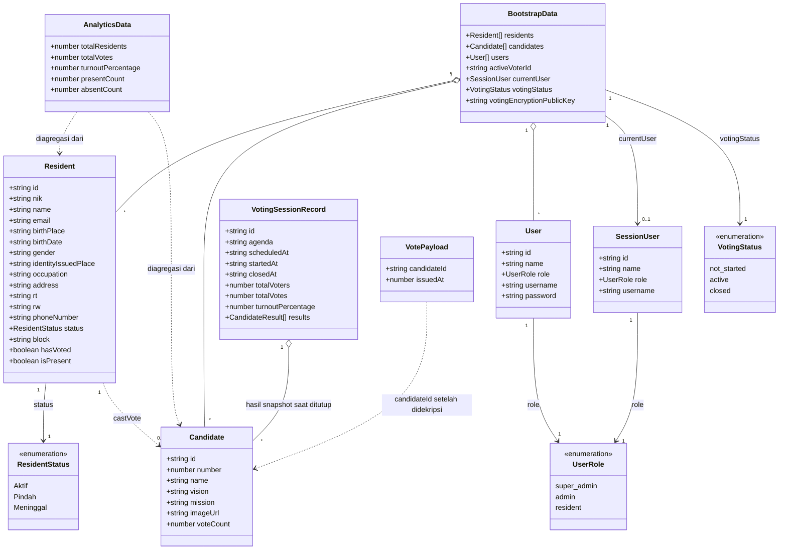
```mermaid
classDiagram
    class Resident {
        +string id
        +string nik
        +string name
        +string email
        +string birthPlace
        +string birthDate
        +string gender
        +string identityIssuedPlace
        +string occupation
        +string address
        +string rt
        +string rw
        +string phoneNumber
        +ResidentStatus status
        +string block
        +boolean hasVoted
        +boolean isPresent
    }

    class Candidate {
        +string id
        +number number
        +string name
        +string vision
        +string mission
        +string imageUrl
        +number voteCount
    }

    class User {
        +string id
        +string name
        +UserRole role
        +string username
        +string password
    }

    class SessionUser {
        +string id
        +string name
        +UserRole role
        +string username
    }

    class VotingSessionRecord {
        +string id
        +string agenda
        +string scheduledAt
        +string startedAt
        +string closedAt
        +number totalVoters
        +number totalVotes
        +number turnoutPercentage
        +CandidateResult[] results
    }

    class VotePayload {
        +string candidateId
        +number issuedAt
    }

    class BootstrapData {
        +Resident[] residents
        +Candidate[] candidates
        +User[] users
        +string activeVoterId
        +SessionUser currentUser
        +VotingStatus votingStatus
        +string votingEncryptionPublicKey
    }

    class AnalyticsData {
        +number totalResidents
        +number totalVotes
        +number turnoutPercentage
        +number presentCount
        +number absentCount
    }

    class VotingStatus {
        <<enumeration>>
        not_started
        active
        closed
    }

    class UserRole {
        <<enumeration>>
        super_admin
        admin
        resident
    }

    class ResidentStatus {
        <<enumeration>>
        Aktif
        Pindah
        Meninggal
    }

    User "1" --> "1" UserRole : role
    SessionUser "1" --> "1" UserRole : role
    Resident "1" --> "1" ResidentStatus : status
    Resident "1" ..> "0..1" Candidate : castVote
    VotePayload ..> Candidate : candidateId setelah didekripsi
    BootstrapData "1" o-- "*" Resident
    BootstrapData "1" o-- "*" Candidate
    BootstrapData "1" o-- "*" User
    BootstrapData "1" --> "0..1" SessionUser : currentUser
    BootstrapData "1" --> "1" VotingStatus : votingStatus
    VotingSessionRecord "1" o-- "*" Candidate : hasil snapshot saat ditutup
    AnalyticsData ..> Resident : diagregasi dari
    AnalyticsData ..> Candidate : diagregasi dari
```

---

## Class Diagram — Modul / Service

Pembagian tanggung jawab antar modul utama sistem (representasi arsitektural, bukan struktur kelas OOP literal).

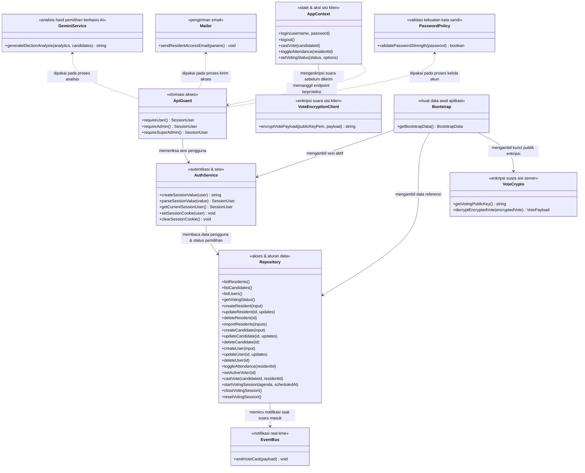
```mermaid
classDiagram
    class AuthService {
        <<autentikasi & sesi>>
        +createSessionValue(user) string
        +parseSessionValue(value) SessionUser
        +getCurrentSessionUser() SessionUser
        +setSessionCookie(user) void
        +clearSessionCookie() void
    }

    class ApiGuard {
        <<otorisasi akses>>
        +requireUser() SessionUser
        +requireAdmin() SessionUser
        +requireSuperAdmin() SessionUser
    }

    class VoteCrypto {
        <<enkripsi suara sisi server>>
        +getVotingPublicKey() string
        +decryptEncryptedVote(encryptedVote) VotePayload
    }

    class VoteEncryptionClient {
        <<enkripsi suara sisi klien>>
        +encryptVotePayload(publicKeyPem, payload) string
    }

    class Repository {
        <<akses & aturan data>>
        +listResidents()
        +listCandidates()
        +listUsers()
        +getVotingStatus()
        +createResident(input)
        +updateResident(id, updates)
        +deleteResident(id)
        +importResidents(inputs)
        +createCandidate(input)
        +updateCandidate(id, updates)
        +deleteCandidate(id)
        +createUser(input)
        +updateUser(id, updates)
        +deleteUser(id)
        +toggleAttendance(residentId)
        +setActiveVoter(id)
        +castVote(candidateId, residentId)
        +startVotingSession(agenda, scheduledAt)
        +closeVotingSession()
        +resetVotingSession()
    }

    class EventBus {
        <<notifikasi real-time>>
        +emitVoteCast(payload) void
    }

    class Bootstrap {
        <<muat data awal aplikasi>>
        +getBootstrapData() BootstrapData
    }

    class Mailer {
        <<pengiriman email>>
        +sendResidentAccessEmail(params) void
    }

    class PasswordPolicy {
        <<validasi kekuatan kata sandi>>
        +validatePasswordStrength(password) boolean
    }

    class GeminiService {
        <<analisis hasil pemilihan berbasis AI>>
        +generateElectionAnalysis(analytics, candidates) string
    }

    class AppContext {
        <<state & aksi sisi klien>>
        +login(username, password)
        +logout()
        +castVote(candidateId)
        +toggleAttendance(residentId)
        +setVotingStatus(status, options)
    }

    ApiGuard --> AuthService : memeriksa sesi pengguna
    AuthService --> Repository : membaca data pengguna & status pemilihan
    Bootstrap --> AuthService : mengambil sesi aktif
    Bootstrap --> Repository : mengambil data referensi
    Bootstrap --> VoteCrypto : mengambil kunci publik enkripsi
    Repository --> EventBus : memicu notifikasi saat suara masuk
    AppContext --> VoteEncryptionClient : mengenkripsi suara sebelum dikirim
    AppContext ..> ApiGuard : memanggil endpoint terproteksi
    GeminiService <.. ApiGuard : dipakai pada proses analisis
    Mailer <.. ApiGuard : dipakai pada proses kirim akses
    PasswordPolicy <.. ApiGuard : dipakai pada proses kelola akun
```

---

## 4.1 Login (Admin & Warga)

Proses masuk ke sistem untuk Admin maupun Warga, termasuk pembatasan bahwa Warga hanya dapat masuk selama pemilihan sedang berlangsung.

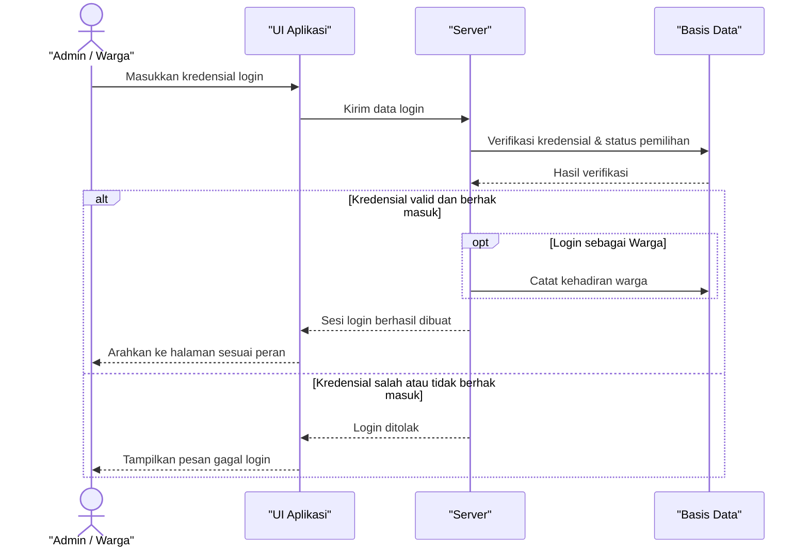
```mermaid
sequenceDiagram
    actor U as "Admin / Warga"
    participant FE as "UI Aplikasi"
    participant BE as "Server"
    participant DB as "Basis Data"

    U->>FE: Masukkan kredensial login
    FE->>BE: Kirim data login
    BE->>DB: Verifikasi kredensial & status pemilihan
    DB-->>BE: Hasil verifikasi
    alt Kredensial valid dan berhak masuk
        opt Login sebagai Warga
            BE->>DB: Catat kehadiran warga
        end
        BE-->>FE: Sesi login berhasil dibuat
        FE-->>U: Arahkan ke halaman sesuai peran
    else Kredensial salah atau tidak berhak masuk
        BE-->>FE: Login ditolak
        FE-->>U: Tampilkan pesan gagal login
    end
```

---

## 4.2 Logout

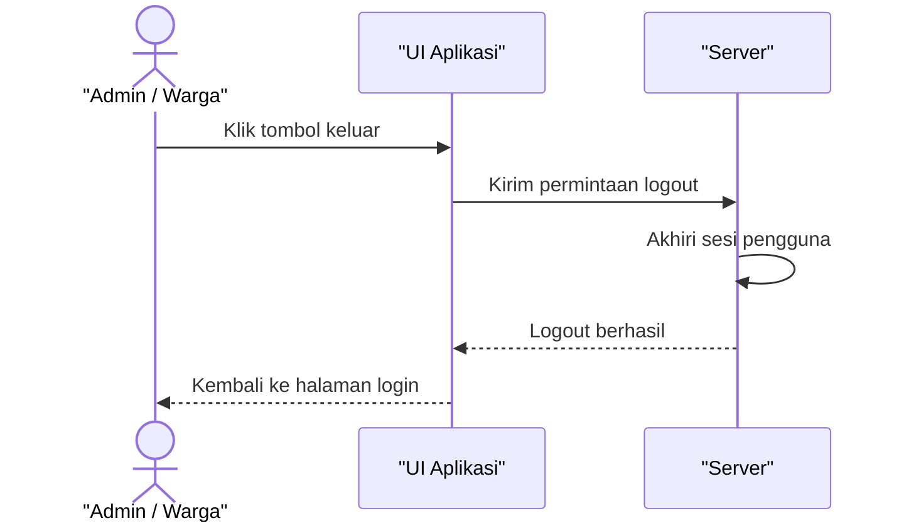
```mermaid
sequenceDiagram
    actor U as "Admin / Warga"
    participant FE as "UI Aplikasi"
    participant BE as "Server"

    U->>FE: Klik tombol keluar
    FE->>BE: Kirim permintaan logout
    BE->>BE: Akhiri sesi pengguna
    BE-->>FE: Logout berhasil
    FE-->>U: Kembali ke halaman login
```

---

## 4.3 Presensi (Attendance Toggle)

Admin mencatat kehadiran warga di lokasi pemungutan suara sebagai syarat sebelum warga dapat memilih.

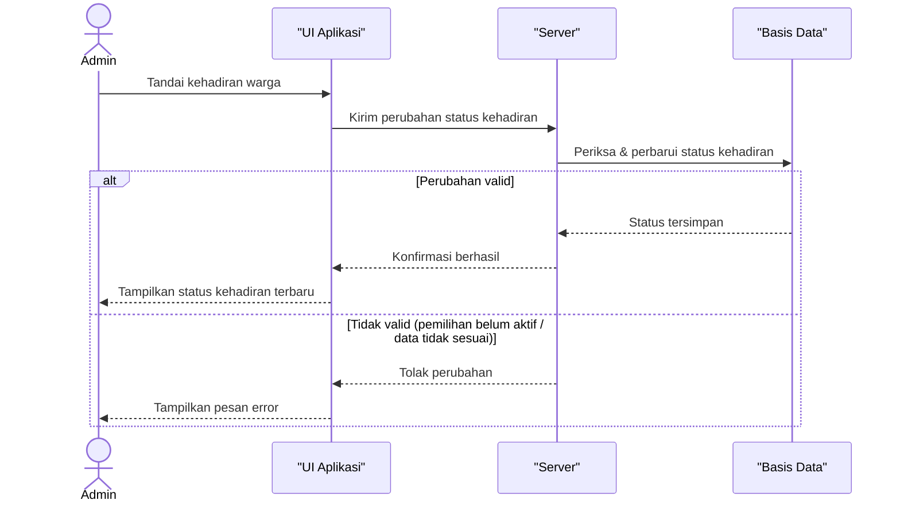
```mermaid
sequenceDiagram
    actor Admin
    participant FE as "UI Aplikasi"
    participant BE as "Server"
    participant DB as "Basis Data"

    Admin->>FE: Tandai kehadiran warga
    FE->>BE: Kirim perubahan status kehadiran
    BE->>DB: Periksa & perbarui status kehadiran
    alt Perubahan valid
        DB-->>BE: Status tersimpan
        BE-->>FE: Konfirmasi berhasil
        FE-->>Admin: Tampilkan status kehadiran terbaru
    else Tidak valid (pemilihan belum aktif / data tidak sesuai)
        BE-->>FE: Tolak perubahan
        FE-->>Admin: Tampilkan pesan error
    end
```

---

## 4.4 Akses Bilik Suara (Set Active Voter)

Admin membuka akses bilik suara untuk satu warga pada satu waktu, memastikan hanya warga yang memenuhi syarat yang dapat memilih.

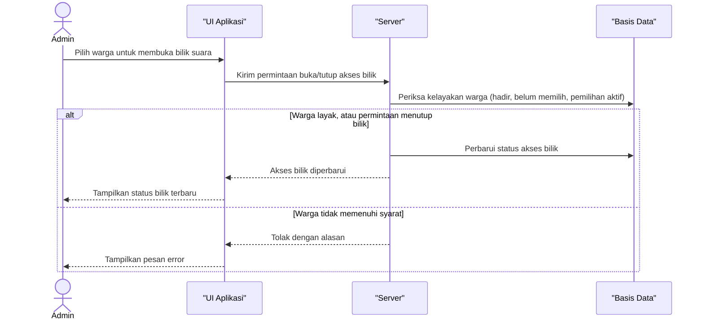
```mermaid
sequenceDiagram
    actor Admin
    participant FE as "UI Aplikasi"
    participant BE as "Server"
    participant DB as "Basis Data"

    Admin->>FE: Pilih warga untuk membuka bilik suara
    FE->>BE: Kirim permintaan buka/tutup akses bilik
    BE->>DB: Periksa kelayakan warga (hadir, belum memilih, pemilihan aktif)
    alt Warga layak, atau permintaan menutup bilik
        BE->>DB: Perbarui status akses bilik
        BE-->>FE: Akses bilik diperbarui
        FE-->>Admin: Tampilkan status bilik terbaru
    else Warga tidak memenuhi syarat
        BE-->>FE: Tolak dengan alasan
        FE-->>Admin: Tampilkan pesan error
    end
```

---

## 4.5 Proses E-Voting End-to-End (Cast Vote)

Proses inti pemungutan suara warga, termasuk enkripsi suara di perangkat warga sebelum dikirim ke server, serta notifikasi real-time ke panel admin.

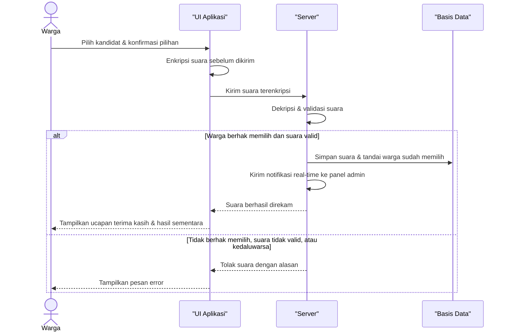
```mermaid
sequenceDiagram
    actor Warga
    participant FE as "UI Aplikasi"
    participant BE as "Server"
    participant DB as "Basis Data"

    Warga->>FE: Pilih kandidat & konfirmasi pilihan
    FE->>FE: Enkripsi suara sebelum dikirim
    FE->>BE: Kirim suara terenkripsi
    BE->>BE: Dekripsi & validasi suara
    alt Warga berhak memilih dan suara valid
        BE->>DB: Simpan suara & tandai warga sudah memilih
        BE->>BE: Kirim notifikasi real-time ke panel admin
        BE-->>FE: Suara berhasil direkam
        FE-->>Warga: Tampilkan ucapan terima kasih & hasil sementara
    else Tidak berhak memilih, suara tidak valid, atau kedaluwarsa
        BE-->>FE: Tolak suara dengan alasan
        FE-->>Warga: Tampilkan pesan error
    end
```

---

## 4.6 Mulai Sesi Voting (Start)

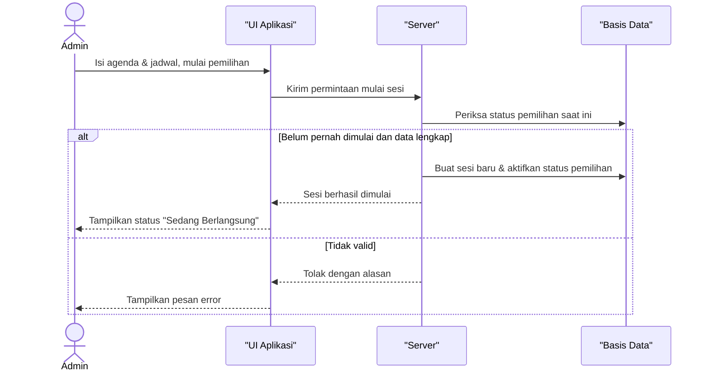
```mermaid
sequenceDiagram
    actor Admin
    participant FE as "UI Aplikasi"
    participant BE as "Server"
    participant DB as "Basis Data"

    Admin->>FE: Isi agenda & jadwal, mulai pemilihan
    FE->>BE: Kirim permintaan mulai sesi
    BE->>DB: Periksa status pemilihan saat ini
    alt Belum pernah dimulai dan data lengkap
        BE->>DB: Buat sesi baru & aktifkan status pemilihan
        BE-->>FE: Sesi berhasil dimulai
        FE-->>Admin: Tampilkan status "Sedang Berlangsung"
    else Tidak valid
        BE-->>FE: Tolak dengan alasan
        FE-->>Admin: Tampilkan pesan error
    end
```

---

## 4.7 Tutup Sesi Voting (Close)

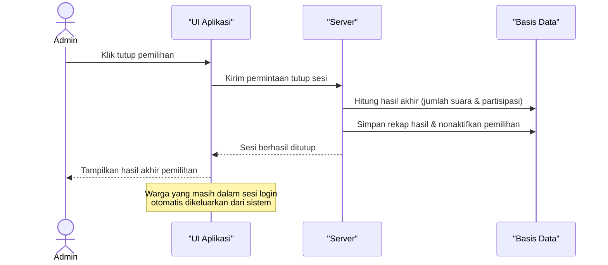
```mermaid
sequenceDiagram
    actor Admin
    participant FE as "UI Aplikasi"
    participant BE as "Server"
    participant DB as "Basis Data"

    Admin->>FE: Klik tutup pemilihan
    FE->>BE: Kirim permintaan tutup sesi
    BE->>DB: Hitung hasil akhir (jumlah suara & partisipasi)
    BE->>DB: Simpan rekap hasil & nonaktifkan pemilihan
    BE-->>FE: Sesi berhasil ditutup
    FE-->>Admin: Tampilkan hasil akhir pemilihan
    Note over FE: Warga yang masih dalam sesi login<br/>otomatis dikeluarkan dari sistem
```

---

## 4.8 Reset Sesi Voting

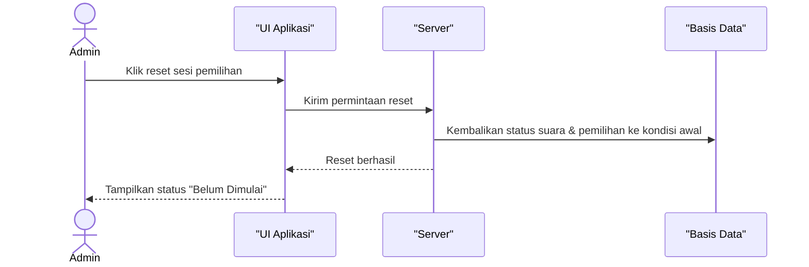
```mermaid
sequenceDiagram
    actor Admin
    participant FE as "UI Aplikasi"
    participant BE as "Server"
    participant DB as "Basis Data"

    Admin->>FE: Klik reset sesi pemilihan
    FE->>BE: Kirim permintaan reset
    BE->>DB: Kembalikan status suara & pemilihan ke kondisi awal
    BE-->>FE: Reset berhasil
    FE-->>Admin: Tampilkan status "Belum Dimulai"
```

---

## 4.9 CRUD Warga (Resident)

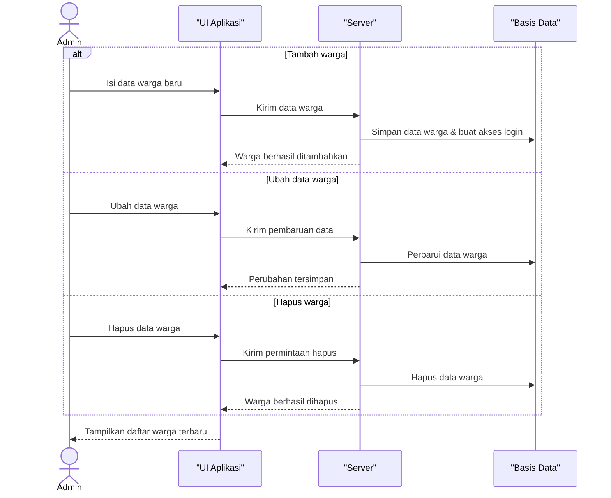
```mermaid
sequenceDiagram
    actor Admin
    participant FE as "UI Aplikasi"
    participant BE as "Server"
    participant DB as "Basis Data"

    alt Tambah warga
        Admin->>FE: Isi data warga baru
        FE->>BE: Kirim data warga
        BE->>DB: Simpan data warga & buat akses login
        BE-->>FE: Warga berhasil ditambahkan
    else Ubah data warga
        Admin->>FE: Ubah data warga
        FE->>BE: Kirim pembaruan data
        BE->>DB: Perbarui data warga
        BE-->>FE: Perubahan tersimpan
    else Hapus warga
        Admin->>FE: Hapus data warga
        FE->>BE: Kirim permintaan hapus
        BE->>DB: Hapus data warga
        BE-->>FE: Warga berhasil dihapus
    end
    FE-->>Admin: Tampilkan daftar warga terbaru
```

---

## 4.10 Import Warga dari Excel

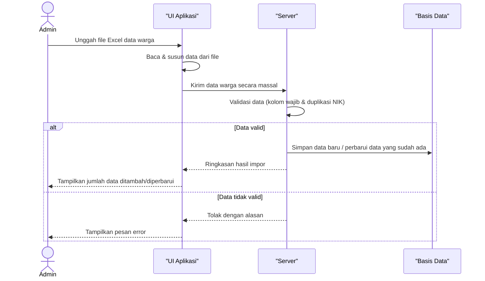
```mermaid
sequenceDiagram
    actor Admin
    participant FE as "UI Aplikasi"
    participant BE as "Server"
    participant DB as "Basis Data"

    Admin->>FE: Unggah file Excel data warga
    FE->>FE: Baca & susun data dari file
    FE->>BE: Kirim data warga secara massal
    BE->>BE: Validasi data (kolom wajib & duplikasi NIK)
    alt Data valid
        BE->>DB: Simpan data baru / perbarui data yang sudah ada
        BE-->>FE: Ringkasan hasil impor
        FE-->>Admin: Tampilkan jumlah data ditambah/diperbarui
    else Data tidak valid
        BE-->>FE: Tolak dengan alasan
        FE-->>Admin: Tampilkan pesan error
    end
```

---

## 4.11 Kelola Akses Warga (Lihat & Kirim Email)

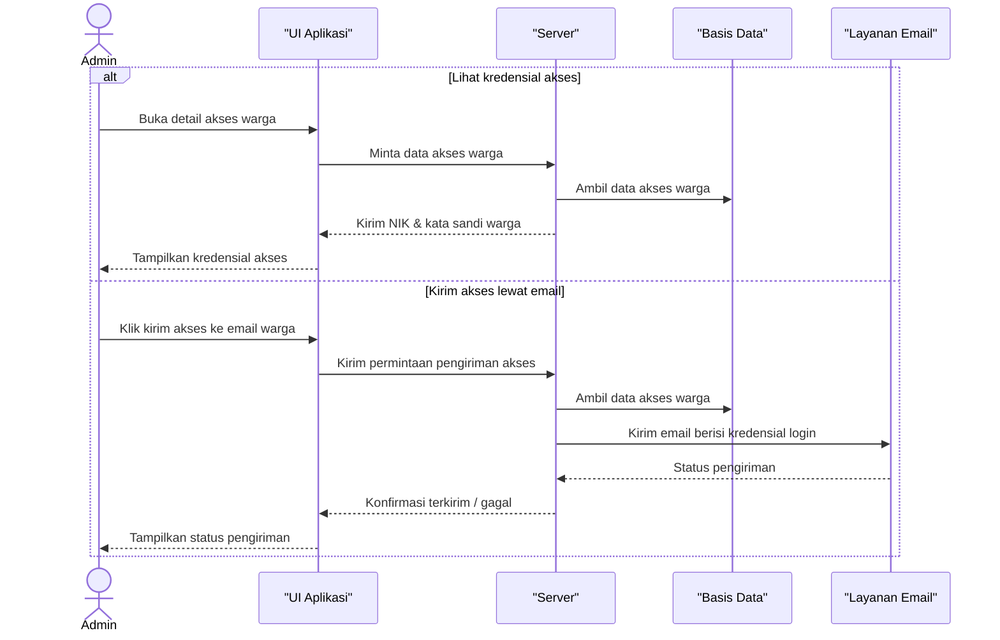
```mermaid
sequenceDiagram
    actor Admin
    participant FE as "UI Aplikasi"
    participant BE as "Server"
    participant DB as "Basis Data"
    participant Mail as "Layanan Email"

    alt Lihat kredensial akses
        Admin->>FE: Buka detail akses warga
        FE->>BE: Minta data akses warga
        BE->>DB: Ambil data akses warga
        BE-->>FE: Kirim NIK & kata sandi warga
        FE-->>Admin: Tampilkan kredensial akses
    else Kirim akses lewat email
        Admin->>FE: Klik kirim akses ke email warga
        FE->>BE: Kirim permintaan pengiriman akses
        BE->>DB: Ambil data akses warga
        BE->>Mail: Kirim email berisi kredensial login
        Mail-->>BE: Status pengiriman
        BE-->>FE: Konfirmasi terkirim / gagal
        FE-->>Admin: Tampilkan status pengiriman
    end
```

---

## 4.12 CRUD Kandidat

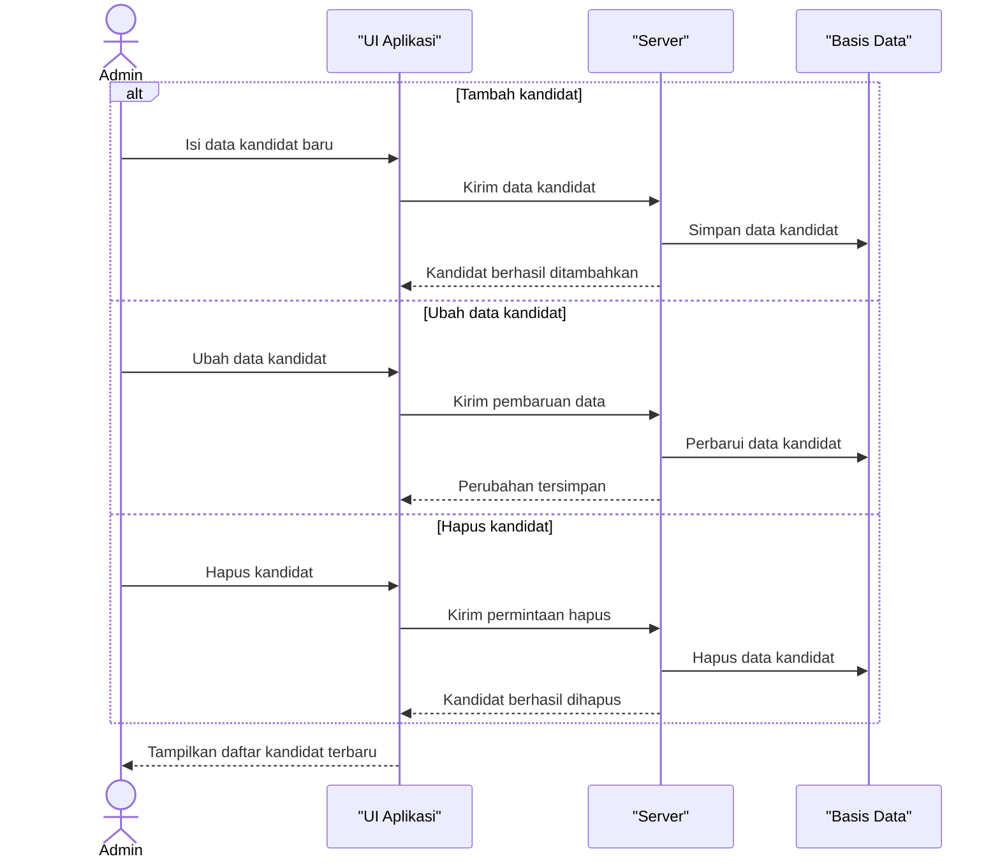
```mermaid
sequenceDiagram
    actor Admin
    participant FE as "UI Aplikasi"
    participant BE as "Server"
    participant DB as "Basis Data"

    alt Tambah kandidat
        Admin->>FE: Isi data kandidat baru
        FE->>BE: Kirim data kandidat
        BE->>DB: Simpan data kandidat
        BE-->>FE: Kandidat berhasil ditambahkan
    else Ubah data kandidat
        Admin->>FE: Ubah data kandidat
        FE->>BE: Kirim pembaruan data
        BE->>DB: Perbarui data kandidat
        BE-->>FE: Perubahan tersimpan
    else Hapus kandidat
        Admin->>FE: Hapus kandidat
        FE->>BE: Kirim permintaan hapus
        BE->>DB: Hapus data kandidat
        BE-->>FE: Kandidat berhasil dihapus
    end
    FE-->>Admin: Tampilkan daftar kandidat terbaru
```

---

## 4.13 CRUD User Admin (Super Admin)

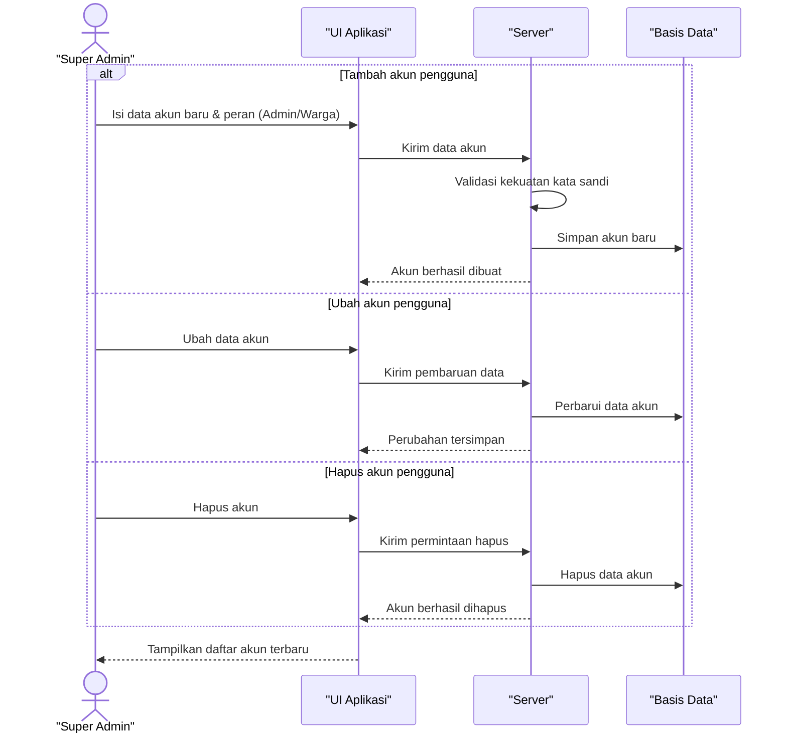
```mermaid
sequenceDiagram
    actor SA as "Super Admin"
    participant FE as "UI Aplikasi"
    participant BE as "Server"
    participant DB as "Basis Data"

    alt Tambah akun pengguna
        SA->>FE: Isi data akun baru & peran (Admin/Warga)
        FE->>BE: Kirim data akun
        BE->>BE: Validasi kekuatan kata sandi
        BE->>DB: Simpan akun baru
        BE-->>FE: Akun berhasil dibuat
    else Ubah akun pengguna
        SA->>FE: Ubah data akun
        FE->>BE: Kirim pembaruan data
        BE->>DB: Perbarui data akun
        BE-->>FE: Perubahan tersimpan
    else Hapus akun pengguna
        SA->>FE: Hapus akun
        FE->>BE: Kirim permintaan hapus
        BE->>DB: Hapus data akun
        BE-->>FE: Akun berhasil dihapus
    end
    FE-->>SA: Tampilkan daftar akun terbaru
```

---

## 4.14 Bootstrap / Initial Load

Proses pemuatan data awal setiap kali aplikasi dibuka, sekaligus memeriksa status sesi login pengguna.

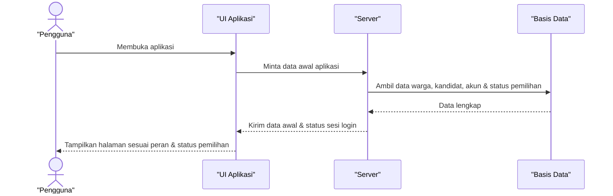
```mermaid
sequenceDiagram
    actor U as "Pengguna"
    participant FE as "UI Aplikasi"
    participant BE as "Server"
    participant DB as "Basis Data"

    U->>FE: Membuka aplikasi
    FE->>BE: Minta data awal aplikasi
    BE->>DB: Ambil data warga, kandidat, akun & status pemilihan
    DB-->>BE: Data lengkap
    BE-->>FE: Kirim data awal & status sesi login
    FE-->>U: Tampilkan halaman sesuai peran & status pemilihan
```

---

## 4.15 Analisis AI Hasil Pemilihan

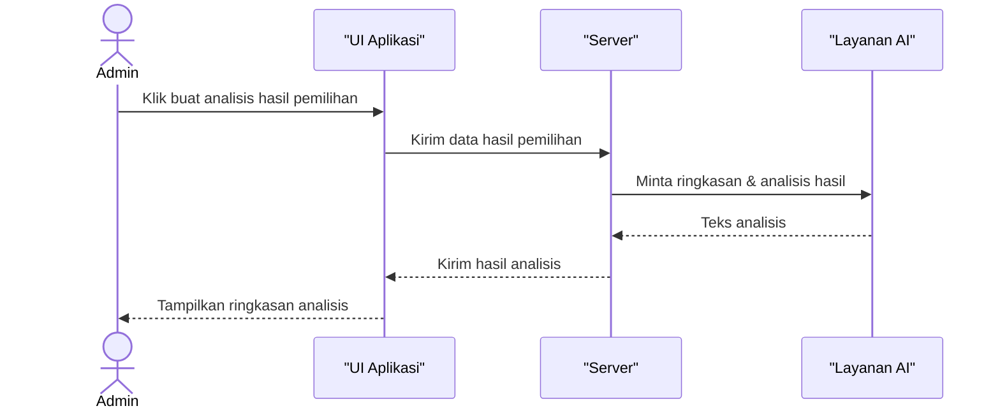
```mermaid
sequenceDiagram
    actor Admin
    participant FE as "UI Aplikasi"
    participant BE as "Server"
    participant AI as "Layanan AI"

    Admin->>FE: Klik buat analisis hasil pemilihan
    FE->>BE: Kirim data hasil pemilihan
    BE->>AI: Minta ringkasan & analisis hasil
    AI-->>BE: Teks analisis
    BE-->>FE: Kirim hasil analisis
    FE-->>Admin: Tampilkan ringkasan analisis
```

---

## 4.16 Live Notifications (SSE)

Panel admin menerima notifikasi secara real-time setiap ada warga yang selesai memilih, tanpa perlu memuat ulang halaman.

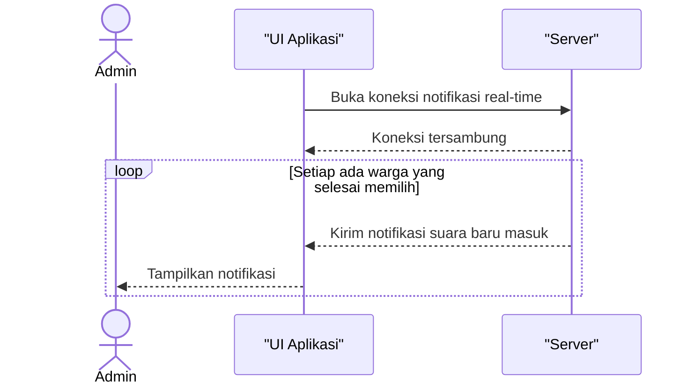
```mermaid
sequenceDiagram
    actor Admin
    participant FE as "UI Aplikasi"
    participant BE as "Server"

    FE->>BE: Buka koneksi notifikasi real-time
    BE-->>FE: Koneksi tersambung
    loop Setiap ada warga yang selesai memilih
        BE-->>FE: Kirim notifikasi suara baru masuk
        FE-->>Admin: Tampilkan notifikasi
    end
```

---

## 5.1 Flowchart Sistem Berjalan (Manual)

Alur proses pemilihan RT/RW yang berjalan saat ini secara manual berbasis kertas, disusun dengan simbol flowchart baku (terminator, proses, decision) dan arah top-down. Termasuk percabangan hasil suara **SAH**, **TIDAK SAH**, dan warga yang tidak menggunakan hak pilih (**GOLPUT**).

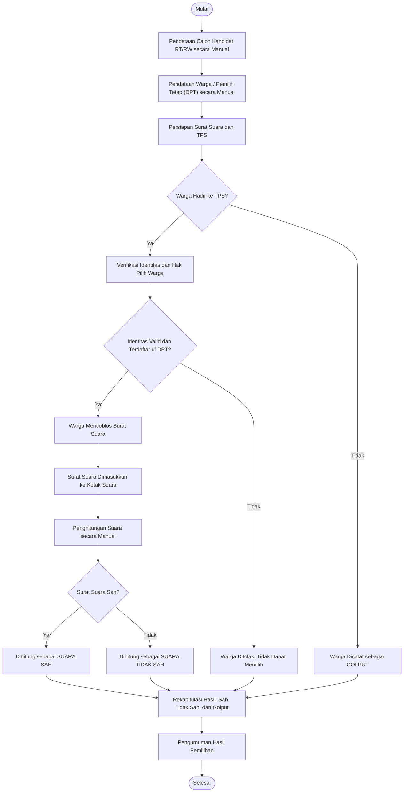
```mermaid
flowchart TD
    A(["Mulai"])
    B["Pendataan Calon Kandidat RT/RW secara Manual"]
    C["Pendataan Warga / Pemilih Tetap (DPT) secara Manual"]
    D["Persiapan Surat Suara dan TPS"]
    E{"Warga Hadir ke TPS?"}
    F["Verifikasi Identitas dan Hak Pilih Warga"]
    G{"Identitas Valid dan Terdaftar di DPT?"}
    H["Warga Mencoblos Surat Suara"]
    I["Surat Suara Dimasukkan ke Kotak Suara"]
    J["Penghitungan Suara secara Manual"]
    K{"Surat Suara Sah?"}
    L["Dihitung sebagai SUARA SAH"]
    M["Dihitung sebagai SUARA TIDAK SAH"]
    N["Warga Dicatat sebagai GOLPUT"]
    O["Warga Ditolak, Tidak Dapat Memilih"]
    P["Rekapitulasi Hasil: Sah, Tidak Sah, dan Golput"]
    Q["Pengumuman Hasil Pemilihan"]
    R(["Selesai"])

    A --> B --> C --> D --> E
    E -->|Ya| F
    E -->|Tidak| N
    F --> G
    G -->|Ya| H
    G -->|Tidak| O
    H --> I --> J --> K
    K -->|Ya| L
    K -->|Tidak| M
    L --> P
    M --> P
    N --> P
    O --> P
    P --> Q --> R
```

### Penjelasan Alur Sistem Berjalan

1. **Mulai** — proses pemilihan RT/RW dimulai sesuai jadwal yang ditentukan panitia/pengurus.
2. **Pendataan Calon Kandidat RT/RW (Manual)** — panitia mencatat data calon kandidat secara manual menggunakan formulir kertas.
3. **Pendataan Warga / Pemilih Tetap (DPT) secara Manual** — panitia mendata warga yang berhak memilih dengan mencatatnya secara manual berdasarkan data kependudukan.
4. **Persiapan Surat Suara dan TPS** — panitia mencetak surat suara secara fisik dan menyiapkan Tempat Pemungutan Suara (TPS) beserta kotak suara.
5. **Keputusan: Apakah warga hadir ke TPS?**
   - **Tidak** → warga dicatat sebagai **GOLPUT** dan langsung masuk ke tahap rekapitulasi (tidak mengikuti proses pencoblosan).
   - **Ya** → proses berlanjut ke verifikasi identitas.
6. **Verifikasi Identitas dan Hak Pilih Warga** — warga yang datang ke TPS diverifikasi secara manual oleh panitia dengan mencocokkan KTP/identitas terhadap daftar pemilih tetap.
7. **Keputusan: Apakah identitas valid dan terdaftar di DPT?**
   - **Tidak** → warga **ditolak**, tidak dapat memilih, dan langsung masuk ke tahap rekapitulasi.
   - **Ya** → warga diizinkan mencoblos.
8. **Warga Mencoblos Surat Suara** — warga memberikan suara dengan mencoblos kertas suara di bilik yang disediakan.
9. **Surat Suara Dimasukkan ke Kotak Suara.**
10. **Penghitungan Suara secara Manual** — setelah waktu pemungutan suara berakhir, panitia menghitung surat suara satu per satu secara manual, disaksikan oleh saksi dari masing-masing kandidat.
11. **Keputusan: Apakah surat suara sah?** (dicoblos sesuai ketentuan, tidak rusak, tidak coblos ganda)
    - **Ya** → dihitung sebagai **SUARA SAH** untuk kandidat yang dipilih.
    - **Tidak** → dihitung sebagai **SUARA TIDAK SAH**.
12. **Rekapitulasi Hasil** — merupakan titik pertemuan dari empat kemungkinan hasil (Suara Sah, Suara Tidak Sah, Golput, dan Ditolak), dicatat secara manual ke dalam berita acara.
13. **Pengumuman Hasil Pemilihan** — hasil pemilihan diumumkan secara langsung/ditempel di papan pengumuman warga.
14. **Selesai** — proses pemilihan RT/RW dinyatakan selesai.

### Kelemahan Sistem Berjalan

- Proses pendataan dan rekapitulasi rawan kesalahan manusia (*human error*).
- Membutuhkan waktu lama, terutama pada tahap penghitungan dan rekapitulasi suara.
- Warga wajib hadir fisik di TPS, menyulitkan pemilih yang berhalangan.
- Dokumen fisik (formulir, surat suara, berita acara) rawan hilang atau rusak.
- Tidak ada mekanisme pengamanan data digital, sehingga transparansi dan audit hasil lebih sulit dilakukan dibanding sistem digital yang datanya dapat dienkripsi dan diverifikasi ulang.

---

## 5.2 Flowchart Sistem Usulan (E-Voting)

Alur proses pemilihan pada sistem usulan (aplikasi Sura Warga), dengan struktur percabangan yang sama seperti sistem berjalan (SAH, TIDAK SAH, GOLPUT) agar dapat dibandingkan langsung dengan Gambar 5.1.

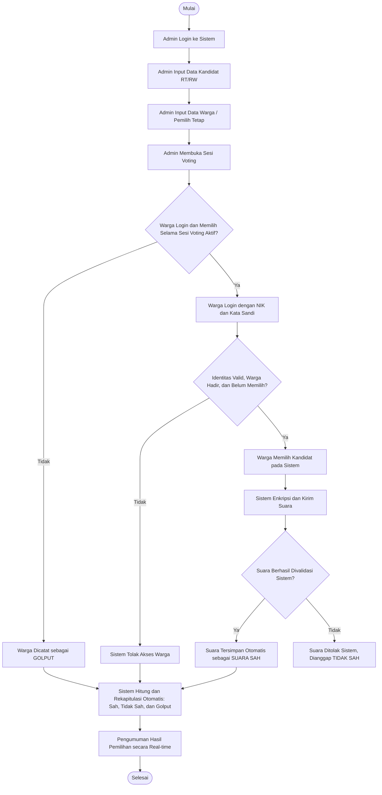
```mermaid
flowchart TD
    A(["Mulai"])
    B["Admin Login ke Sistem"]
    C["Admin Input Data Kandidat RT/RW"]
    D["Admin Input Data Warga / Pemilih Tetap"]
    E["Admin Membuka Sesi Voting"]
    F{"Warga Login dan Memilih Selama Sesi Voting Aktif?"}
    G["Warga Login dengan NIK dan Kata Sandi"]
    H{"Identitas Valid, Warga Hadir, dan Belum Memilih?"}
    I["Warga Memilih Kandidat pada Sistem"]
    J["Sistem Enkripsi dan Kirim Suara"]
    K{"Suara Berhasil Divalidasi Sistem?"}
    L["Suara Tersimpan Otomatis sebagai SUARA SAH"]
    M["Suara Ditolak Sistem, Dianggap TIDAK SAH"]
    N["Warga Dicatat sebagai GOLPUT"]
    O["Sistem Tolak Akses Warga"]
    P["Sistem Hitung dan Rekapitulasi Otomatis: Sah, Tidak Sah, dan Golput"]
    Q["Pengumuman Hasil Pemilihan secara Real-time"]
    R(["Selesai"])

    A --> B --> C --> D --> E --> F
    F -->|Tidak| N
    F -->|Ya| G --> H
    H -->|Tidak| O
    H -->|Ya| I --> J --> K
    K -->|Ya| L
    K -->|Tidak| M
    L --> P
    N --> P
    O --> P
    P --> Q --> R
```

> **Catatan:** Pada sistem usulan, kategori **TIDAK SAH** bersifat berbeda secara teknis dari sistem manual. Karena validasi (identitas, kandidat, waktu kirim) dilakukan sistem *sebelum* suara disimpan, suara yang gagal validasi **tidak pernah tersimpan ke basis data** — bukan tersimpan lalu dihitung tidak sah seperti surat suara rusak pada sistem manual. Percabangan ini tetap digambarkan agar struktur flowchart sebanding dengan Gambar 5.1, sekaligus untuk menonjolkan bahwa sistem usulan meniadakan risiko suara tidak sah akibat kesalahan manusia (human error) saat mencoblos.

### Penjelasan Alur Sistem Usulan

1. **Mulai** — proses pemilihan RT/RW pada sistem dimulai sesuai jadwal yang ditentukan pengurus.
2. **Admin Login ke Sistem** — pengurus/panitia masuk ke aplikasi menggunakan akun admin.
3. **Admin Input Data Kandidat RT/RW** — data calon kandidat dimasukkan ke sistem melalui form digital, menggantikan pencatatan kertas.
4. **Admin Input Data Warga / Pemilih Tetap** — data warga yang berhak memilih diinput/diimpor ke sistem beserta NIK, menggantikan pendataan manual.
5. **Admin Membuka Sesi Voting** — pengurus mengaktifkan status pemilihan sehingga warga dapat mulai login dan memilih.
6. **Keputusan: Apakah warga login dan memilih selama sesi voting aktif?**
   - **Tidak** (warga tidak login/tidak memilih sampai sesi ditutup) → warga dicatat sebagai **GOLPUT**, langsung masuk ke tahap rekapitulasi.
   - **Ya** → proses berlanjut ke login warga.
7. **Warga Login dengan NIK dan Kata Sandi** — warga masuk ke sistem menggunakan kredensial yang telah dibagikan.
8. **Keputusan: Apakah identitas valid, warga hadir, dan belum memilih?** — sistem memeriksa status kehadiran dan memastikan warga belum menggunakan hak pilihnya.
   - **Tidak** → **sistem menolak akses** warga, langsung masuk ke tahap rekapitulasi.
   - **Ya** → warga diizinkan memilih kandidat.
9. **Warga Memilih Kandidat pada Sistem** — warga menentukan pilihan kandidat melalui antarmuka aplikasi.
10. **Sistem Enkripsi dan Kirim Suara** — pilihan warga dienkripsi di perangkat warga sebelum dikirim ke server.
11. **Keputusan: Apakah suara berhasil divalidasi sistem?** (dekripsi berhasil, kandidat valid, dan waktu kirim belum kedaluwarsa)
    - **Ya** → suara tersimpan otomatis sebagai **SUARA SAH**.
    - **Tidak** → suara **ditolak sistem** dan dianggap **TIDAK SAH** (lihat catatan di atas — permintaan gagal ini tidak pernah tersimpan ke basis data).
12. **Rekapitulasi Otomatis** — merupakan titik pertemuan dari tiga kemungkinan hasil (Suara Sah, Golput, dan Ditolak Sistem) yang dihitung otomatis oleh sistem tanpa campur tangan manual.
13. **Pengumuman Hasil Pemilihan secara Real-time** — hasil pemilihan dapat langsung dilihat melalui aplikasi begitu sesi voting ditutup.
14. **Selesai** — proses pemilihan RT/RW pada sistem dinyatakan selesai.

### Kelebihan Sistem Usulan

- Pendataan kandidat dan warga dilakukan secara digital, mengurangi risiko kesalahan pencatatan manual.
- Proses penghitungan dan rekapitulasi suara berjalan otomatis, sehingga jauh lebih cepat dibanding penghitungan manual.
- Warga dapat memilih tanpa perlu antre lama secara fisik, cukup melalui bilik/perangkat yang tersedia selama sesi voting aktif.
- Suara warga dienkripsi (RSA-OAEP) sebelum dikirim, sehingga kerahasiaan pilihan lebih terjaga.
- Sistem secara otomatis mencegah kecurangan seperti pemilih ganda (`hasVoted`) dan suara yang tidak memenuhi syarat, sehingga risiko suara tidak sah akibat kesalahan manusia jauh berkurang dibanding sistem manual.
- Data tersimpan secara digital dan dapat diaudit ulang, meningkatkan transparansi dibanding dokumen fisik yang rawan hilang/rusak.
